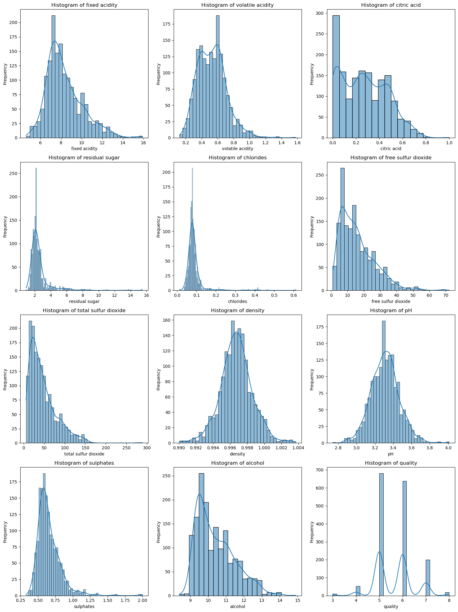
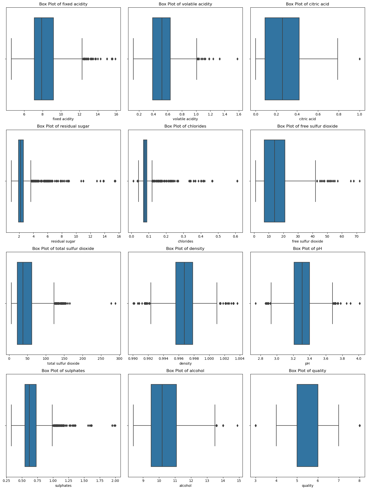
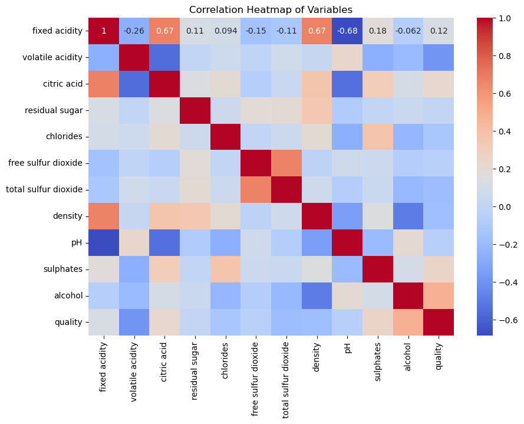

# Red-Wine-Quality-Predictions

---

## Contents
:book: **[Introduction](#introduction)** | :scroll: **[Data Description](#data-description)** | :bar_chart: **[Data Visualization](#data-visualization)** | :robot: **[Models](#models)** | :trophy: **[Results](#results)**

---

## :book: Introduction

*This project aims to predict the quality of red wines using a variety of machine learning models. We analyze and model the dataset with the following five different algorithms:*

- **Artificial Neural Networks (ANN)**
- **K-Nearest Neighbors (KNN)**
- **Support Vector Machines (SVM)**
- **Random Forest**
- **Naive Bayes**

---

## :scroll: Data Description

*The dataset used in this project is the "Red Wine Quality" dataset.*

#### Source Links:
- UCI Machine Learning Repository: [Red Wine Quality](https://archive.ics.uci.edu/ml/datasets/wine+quality)
- Kaggle: [Red Wine Quality](https://www.kaggle.com/uciml/red-wine-quality-cortez-et-al-2009)

#### Features and Response Variable:
*The dataset comprises 12 features that describe various physicochemical properties of wine. The features included are:*

1. Fixed acidity
2. Volatile acidity
3. Citric acid
4. Residual sugar
5. Chlorides
6. Free sulfur dioxide
7. Total sulfur dioxide
8. Density
9. pH
10. Sulphates
11. Alcohol
12. Quality (response variable)

---

## :bar_chart: Data Visualization

*Comprehensive visualizations of each feature in the dataset are provided to assist in understanding the distributions and relationships.*

- **Histograms Displaying Variable Distributions** 
- **Boxplots Illustrating Variable Spread and Outliers** 
- **Correlation Heatmap of Features** 

*These visualizations can be viewed in the `data_visualization.ipynb` notebook.*

---

## :robot: Models

*The models are saved and can be found in the `models` directory.*

*For a detailed look into the training parameters and testing results for each model, please refer to the corresponding Jupyter notebook files located in the repository.*

---

## :trophy: Results

*The performance of each model is summarized below:*

| Model          | F1 Score | Accuracy |
|----------------|----------|----------|
| ANN            | 0.60     | 61.46%   |
| KNN            | 0.65     | 66.04%   |
| SVM            | 0.63     | 64.17%   |
| Random Forest  | 0.70     | 71.25%   |
| Naive Bayes    | 0.60     | 61.25%   |

---
